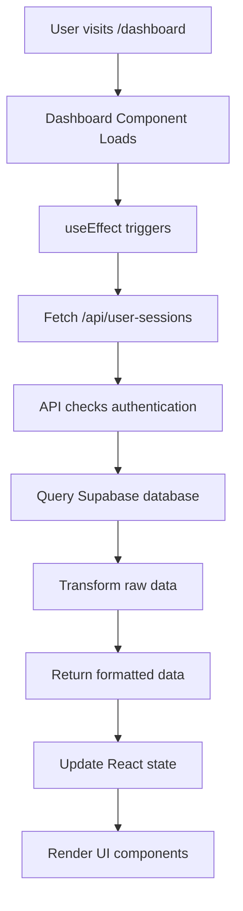

# Dashboard Implementation Guide - Complete Beginner's Tutorial

## Table of Contents
1. [Overview](#overview)
2. [Understanding the Data Flow](#understanding-the-data-flow)
3. [Database Structure](#database-structure)
4. [API Layer (Backend)](#api-layer-backend)
5. [Frontend Components](#frontend-components)
6. [State Management](#state-management)
7. [Error Handling](#error-handling)
8. [Step-by-Step Implementation](#step-by-step-implementation)
9. [Common Patterns Explained](#common-patterns-explained)
10. [Troubleshooting](#troubleshooting)

---

## Overview

Your dashboard displays user practice session data, including IELTS/TOEFL scores, feedback, and practice history. The implementation follows a typical Next.js pattern:

```
Database (Supabase) → API Route → React Component → UI Components
```

---

## Understanding the Data Flow

### 1. The Journey of Data



### 2. What Happens When?

1. **Page Load**: User navigates to `/dashboard`
2. **Component Mount**: React component initializes
3. **Data Fetch**: API call to get user sessions
4. **Authentication**: Server verifies user is logged in
5. **Database Query**: Fetch sessions from Supabase
6. **Data Transformation**: Convert raw DB data to UI-friendly format
7. **State Update**: Update React state with new data
8. **UI Render**: Display components with data

---

## Database Structure

### Your Sessions Table Schema

```sql
-- This is what your Supabase table looks like
CREATE TABLE sessions (
    id UUID PRIMARY KEY,                    -- Unique session identifier
    user_id UUID REFERENCES auth.users,    -- Which user owns this session
    created_at TIMESTAMP,                  -- When session was created
    level VARCHAR,                         -- Difficulty level (beginner, intermediate, etc.)
    ielts_rating JSONB,                   -- IELTS scores as JSON object
    toefl_rating JSONB,                   -- TOEFL scores as JSON object
    feedback JSONB                        -- Feedback as JSON object
);
```

### Sample Data Structure

```javascript
// Raw data from database
{
  id: "123e4567-e89b-12d3-a456-426614174000",
  user_id: "user-uuid",
  created_at: "2024-01-15T10:30:00Z",
  level: "intermediate",
  ielts_rating: {
    fluency: 7.5,
    grammar: 8.0,
    vocabulary: 7.0,
    pronunciation: 7.5,
    overall: 7.5
  },
  toefl_rating: {
    delivery: 22,
    language_use: 24,
    topic_development: 23,
    overall: 23
  },
  feedback: {
    positives: ["Good vocabulary usage", "Clear pronunciation"],
    negatives: ["Work on grammar", "Improve fluency"]
  }
}
```

---

## API Layer (Backend)

### File: `/app/api/user-sessions/route.ts`

Let's break down your API route step by step:

```typescript
import { createClient } from "@/lib/server";
import { NextRequest, NextResponse } from "next/server";

export async function GET(request: NextRequest) {
  try {
    // Step 1: Create Supabase Client
    // This connects to your Supabase database
    const supabase = await createClient();

    // Step 2: Authentication Check
    // Get the currently logged-in user from the session
    const {
      data: { user },
      error: authError,
    } = await supabase.auth.getUser();

    // If no user is logged in, return 401 Unauthorized
    if (authError || !user) {
      return NextResponse.json({ error: "Unauthorized" }, { status: 401 });
    }

    // Step 3: Database Query
    // Fetch all sessions belonging to this user
    const { data: sessions, error } = await supabase
      .from("sessions")                    // From the 'sessions' table
      .select("*")                         // Select all columns
      .eq("user_id", user.id)             // Where user_id matches current user
      .order("created_at", { ascending: false }); // Newest sessions first

    // Step 4: Error Handling
    if (error) {
      console.error("Error fetching sessions:", error);
      return NextResponse.json(
        { error: "Failed to fetch sessions" },
        { status: 500 }
      );
    }

    // Step 5: Handle Empty Data
    // If no sessions exist, return empty array
    if (!sessions) {
      return NextResponse.json({
        success: true,
        sessions: [],
        averageIeltsScore: 0,
        averageToeflScore: 0,
      });
    }

    // Step 6: Data Transformation
    // Convert raw database data to frontend-friendly format
    const transformedSessions = sessions.map((session) => ({
      id: session.id,
      date: new Date(session.created_at).toLocaleDateString(), // Format date
      level: session.level || "Unknown Level",
      ieltsScore: session.ielts_rating?.overall || 0,          // Extract overall scores
      toeflScore: session.toefl_rating?.overall || 0,
      scores: {
        // Individual IELTS component scores
        fluency: session.ielts_rating?.fluency || 0,
        grammar: session.ielts_rating?.grammar || 0,
        vocabulary: session.ielts_rating?.vocabulary || 0,
        pronunciation: session.ielts_rating?.pronunciation || 0,
        // Individual TOEFL component scores
        delivery: session.toefl_rating?.delivery || 0,
        language_use: session.toefl_rating?.language_use || 0,
        topic_development: session.toefl_rating?.topic_development || 0,
      },
      feedback: {
        positivePoints: session.feedback?.positives || [],
        negativePoints: session.feedback?.negatives || [],
      },
    }));

    // Step 7: Calculate Averages
    // Filter out zero scores and calculate averages
    const ieltsScores = transformedSessions
      .map((s) => s.ieltsScore)
      .filter((score) => score > 0);
    
    const toeflScores = transformedSessions
      .map((s) => s.toeflScore)
      .filter((score) => score > 0);

    const averageIeltsScore =
      ieltsScores.length > 0
        ? ieltsScores.reduce((sum, score) => sum + score, 0) / ieltsScores.length
        : 0;

    const averageToeflScore =
      toeflScores.length > 0
        ? toeflScores.reduce((sum, score) => sum + score, 0) / toeflScores.length
        : 0;

    // Step 8: Return Formatted Response
    return NextResponse.json({
      success: true,
      sessions: transformedSessions,
      averageIeltsScore,
      averageToeflScore,
    });

  } catch (error) {
    // Step 9: Global Error Handling
    console.log("api error in sessions fetching for user ", error);
    return NextResponse.json(
      { error: "internal server error" },
      { status: 500 }
    );
  }
}
```

### Key Concepts Explained:

1. **NextRequest/NextResponse**: Next.js types for handling HTTP requests
2. **Supabase Client**: Connection to your database
3. **Authentication**: Checking if user is logged in
4. **Query Builder**: Supabase's way to build database queries
5. **Data Transformation**: Converting raw data to usable format
6. **Error Handling**: Gracefully handling various error scenarios

---

## Frontend Components

### File: `/app/(main-app)/dashboard/page.tsx`

Let's break down your main dashboard component:

```typescript
"use client"; // This makes it a client component (runs in browser)
import { DashboardHeader } from "@/components/dashboard/DashboardHeader";
import { OverallScores } from "@/components/dashboard/OverallScores";
import { PracticeHistory } from "@/components/dashboard/PracticeHistory";
import { StartNewSession } from "@/components/dashboard/StartNewSession";
import { TipsForImprovement } from "@/components/dashboard/TipsForImprovement";
import { DashboardData } from "@/types/types";
import { redirect } from "next/navigation";
import React, { useEffect, useState } from "react";

function Dashboard() {
  // State Management - This is where we store our data
  const [dashboardData, setDashboardData] = useState<DashboardData | null>(null);
  const [loading, setLoading] = useState(true);           // Loading state
  const [error, setError] = useState<string | null>(null); // Error state

  // useEffect runs when component mounts (page loads)
  useEffect(() => {
    checkUserAndFetchData(); // Start the data fetching process
  }, []); // Empty dependency array means this runs once on mount

  // Main function that coordinates data fetching
  const checkUserAndFetchData = async () => {
    try {
      await fetchDashboardData();
    } catch (error) {
      console.error("Error fetching dashboard data: ", error);
      setError("Failed to load dashboard data");
      setLoading(false);
    }
  };

  // Function that actually fetches data from API
  const fetchDashboardData = async () => {
    try {
      setLoading(true);     // Show loading state
      setError(null);       // Clear any previous errors
      
      // Make HTTP request to our API
      const response = await fetch("/api/user-sessions", {
        method: "GET",
        credentials: "include", // Include cookies for authentication
      });
      
      // Handle authentication errors
      if (response.status === 401) {
        redirect("/auth/login"); // Redirect to login page
        return;
      }
      
      // Handle other HTTP errors
      if (!response.ok) {
        throw new Error(`Failed to fetch data: ${response.status}`);
      }
      
      // Parse JSON response
      const data: DashboardData = await response.json();
      setDashboardData(data); // Update state with new data
      
    } catch (err) {
      console.log("error while fetching data from database: ", err);
      setError(
        err instanceof Error ? err.message : "Failed to load dashboard data"
      );
    } finally {
      setLoading(false); // Always stop loading, regardless of success/failure
    }
  };

  // Loading State UI
  if (loading) {
    return (
      <div className="min-h-screen bg-gray-50 p-4 md:p-6">
        <div className="max-w-7xl mx-auto">
          <div className="flex items-center justify-center min-h-[60vh]">
            <div className="text-center">
              {/* Spinning loading indicator */}
              <div className="animate-spin rounded-full h-12 w-12 border-b-2 border-blue-600 mx-auto mb-4"></div>
              <p className="text-gray-600 text-lg">Loading your dashboard...</p>
            </div>
          </div>
        </div>
      </div>
    );
  }

  // Error State UI
  if (error) {
    return (
      <div className="min-h-screen bg-gray-50 p-4 md:p-6">
        <div className="max-w-7xl mx-auto">
          <div className="flex items-center justify-center min-h-[60vh]">
            <div className="text-center bg-white p-8 rounded-xl shadow-sm border">
              {/* Error icon */}
              <div className="text-red-500 mb-4">
                <svg className="h-12 w-12 mx-auto" fill="none" viewBox="0 0 24 24" stroke="currentColor">
                  <path strokeLinecap="round" strokeLinejoin="round" strokeWidth={2} d="M12 9v2m0 4h.01m-6.938 4h13.856c1.54 0 2.502-1.667 1.732-2.5L13.732 4c-.77-.833-1.732-.833-2.5 0L4.268 19.5c-.77.833.192 2.5 1.732 2.5z" />
                </svg>
              </div>
              <h3 className="text-xl font-semibold text-gray-900 mb-2">Something went wrong</h3>
              <p className="text-gray-600 mb-6">{error}</p>
              {/* Retry button */}
              <button
                onClick={checkUserAndFetchData}
                className="px-6 py-3 bg-blue-600 text-white rounded-lg hover:bg-blue-700 transition-colors font-medium"
              >
                Try Again
              </button>
            </div>
          </div>
        </div>
      </div>
    );
  }

  // Empty State UI (no sessions)
  if (!dashboardData || !dashboardData.sessions || dashboardData.sessions.length === 0) {
    return (
      <div className="min-h-screen bg-gray-50 p-4 md:p-6">
        <div className="max-w-7xl mx-auto">
          <DashboardHeader
            title="Welcome to Your Dashboard"
            description="Start practicing to see your progress and get personalized feedback."
          />
          <div className="flex items-center justify-center min-h-[50vh]">
            <div className="text-center bg-white p-8 rounded-xl shadow-sm border max-w-md">
              {/* Empty state icon */}
              <div className="text-gray-400 mb-6">
                <svg className="h-16 w-16 mx-auto" fill="none" viewBox="0 0 24 24" stroke="currentColor">
                  <path strokeLinecap="round" strokeLinejoin="round" strokeWidth={1.5} d="M9 12h6m-6 4h6m2 5H7a2 2 0 01-2-2V5a2 2 0 012-2h5.586a1 1 0 01.707.293l5.414 5.414a1 1 0 01.293.707V19a2 2 0 01-2 2z" />
                </svg>
              </div>
              <h3 className="text-2xl font-bold text-gray-900 mb-3">No Practice Sessions Yet</h3>
              <p className="text-gray-600 mb-8 leading-relaxed">
                Take your first practice test to get detailed feedback and track your improvement over time.
              </p>
              <StartNewSession href="/levels" />
            </div>
          </div>
        </div>
      </div>
    );
  }

  // Data Processing for Components
  // Transform the API data into format expected by UI components
  const sessions = dashboardData.sessions.map((session) => ({
    id: session.id,
    date: session.date,
    level: session.level,
    ieltsScore: session.ieltsScore,
    toeflScore: session.toeflScore,
    transcriptUrl: `/results/${session.id}`, // Link to detailed results
  }));

  // Main Dashboard UI (when data is loaded successfully)
  return (
    <div className="min-h-screen bg-gray-50 p-4 md:p-6">
      <div className="max-w-7xl mx-auto space-y-6">
        {/* Dashboard Header */}
        <DashboardHeader
          title="Your Progress Dashboard"
          description="Track your performance and see detailed insights from your practice sessions."
        />

        {/* Grid Layout: Main content + Sidebar */}
        <div className="grid grid-cols-1 xl:grid-cols-4 gap-6">
          {/* Main content area (takes 3/4 of width on large screens) */}
          <div className="xl:col-span-3 space-y-6">
            {/* Overall Scores Component */}
            <OverallScores
              ieltsAverage={dashboardData.averageIeltsScore}
              toeflAverage={dashboardData.averageToeflScore}
              totalSessions={dashboardData.sessions.length}
            />
            {/* Practice History Component */}
            <PracticeHistory sessions={sessions} />
          </div>

          {/* Sidebar (takes 1/4 of width on large screens) */}
          <div className="space-y-6">
            {/* Tips Component - uses latest session feedback */}
            <TipsForImprovement
              tips={dashboardData.sessions?.[0]?.feedback?.positivePoints || []}
              improvements={dashboardData.sessions?.[0]?.feedback?.negativePoints || []}
            />
            {/* Start New Session Button */}
            <StartNewSession href="/levels" />
          </div>
        </div>
      </div>
    </div>
  );
}

export default Dashboard;
```

---

## State Management

### Understanding React State

React state is how we store and manage data that can change over time. In your dashboard:

```typescript
// State holds data that can change
const [dashboardData, setDashboardData] = useState<DashboardData | null>(null);
const [loading, setLoading] = useState(true);
const [error, setError] = useState<string | null>(null);
```

### State Flow:

1. **Initial State**: `loading: true`, `data: null`, `error: null`
2. **During Fetch**: `loading: true`, `data: null`, `error: null`
3. **Success**: `loading: false`, `data: [session data]`, `error: null`
4. **Error**: `loading: false`, `data: null`, `error: "error message"`

### Why This Pattern Works:

- **Predictable**: Always know what state the component is in
- **User-Friendly**: Shows appropriate UI for each state
- **Robust**: Handles errors gracefully

---

## Error Handling

### Three Levels of Error Handling:

#### 1. API Level (Backend)
```typescript
try {
  // Database operations
} catch (error) {
  return NextResponse.json({ error: "descriptive message" }, { status: 500 });
}
```

#### 2. Fetch Level (Frontend)
```typescript
try {
  const response = await fetch("/api/user-sessions");
  if (!response.ok) {
    throw new Error(`HTTP ${response.status}`);
  }
} catch (error) {
  setError("Failed to load data");
}
```

#### 3. UI Level (React Component)
```typescript
if (error) {
  return <ErrorComponent message={error} onRetry={fetchData} />;
}
```

---

## Step-by-Step Implementation

### Step 1: Set Up Types

Create type definitions in `/types/types.ts`:

```typescript
// Raw database session structure
export interface DashboardSession {
  id: string;
  user_id: string;
  created_at: string;
  level: string;
  ielts_rating: {
    fluency: number;
    grammar: number;
    overall: number;
    vocabulary: number;
    pronunciation: number;
  } | null;
  toefl_rating: {
    overall: number;
    delivery: number;
    language_use: number;
    topic_development: number;
  } | null;
  feedback: {
    negatives: string[];
    positives: string[];
  } | null;
}

// Transformed session for UI
export interface TransformedDashboardSession {
  id: string;
  date: string;
  level: string;
  ieltsScore: number;
  toeflScore: number;
  scores: {
    fluency: number;
    grammar: number;
    vocabulary: number;
    pronunciation: number;
    delivery: number;
    language_use: number;
    topic_development: number;
  };
  feedback: {
    positivePoints: string[];
    negativePoints: string[];
  };
}

// API response structure
export interface DashboardData {
  success: boolean;
  sessions: TransformedDashboardSession[];
  totalSessions: number;
  averageIeltsScore: number;
  averageToeflScore: number;
}
```

### Step 2: Create API Route

File: `/app/api/user-sessions/route.ts`

```typescript
export async function GET(request: NextRequest) {
  // 1. Authentication
  // 2. Database query
  // 3. Data transformation
  // 4. Return response
}
```

### Step 3: Create Dashboard Component

File: `/app/(main-app)/dashboard/page.tsx`

```typescript
export default function Dashboard() {
  // 1. Set up state
  // 2. Fetch data on mount
  // 3. Handle loading/error/success states
  // 4. Render appropriate UI
}
```

### Step 4: Create Child Components

Each component handles a specific part of the dashboard:

- `DashboardHeader`: Title and description
- `OverallScores`: Average scores display
- `PracticeHistory`: List of past sessions
- `TipsForImprovement`: Feedback display
- `StartNewSession`: Call-to-action button

---

## Common Patterns Explained

### 1. The "Fetch on Mount" Pattern

```typescript
useEffect(() => {
  fetchData(); // Run once when component mounts
}, []); // Empty dependency array = run once
```

### 2. The "Loading-Error-Success" Pattern

```typescript
if (loading) return <LoadingUI />;
if (error) return <ErrorUI />;
if (!data) return <EmptyUI />;
return <SuccessUI data={data} />;
```

### 3. The "Transform Data" Pattern

```typescript
// Raw data from API
const rawData = await fetch('/api/data');

// Transform for UI
const uiData = rawData.map(item => ({
  id: item.id,
  displayName: item.name.toUpperCase(),
  formattedDate: new Date(item.created_at).toLocaleDateString()
}));
```

### 4. The "Conditional Rendering" Pattern

```typescript
{/* Only render if data exists */}
{data && <Component data={data} />}

{/* Render different things based on condition */}
{sessions.length > 0 ? (
  <SessionsList sessions={sessions} />
) : (
  <EmptyState />
)}
```

---

## Troubleshooting

### Common Issues and Solutions:

#### 1. "Cannot read property of undefined"
**Problem**: Trying to access nested data before it's loaded
```typescript
// ❌ Wrong
session.ielts_rating.overall

// ✅ Correct
session.ielts_rating?.overall || 0
```

#### 2. "Network request failed"
**Problem**: API endpoint not accessible
- Check if API route file exists
- Verify route path matches fetch URL
- Check browser Network tab for details

#### 3. "Unauthorized" error
**Problem**: User not authenticated
- Verify user is logged in
- Check authentication middleware
- Ensure cookies are included in requests

#### 4. Data not displaying
**Problem**: State not updating
- Check if state setter is called
- Verify useEffect dependencies
- Use React DevTools to inspect state

#### 5. Infinite re-renders
**Problem**: useEffect dependency issues
```typescript
// ❌ Wrong - missing dependency
useEffect(() => {
  fetchData();
}, []);

// ✅ Correct - include all dependencies
useEffect(() => {
  fetchData();
}, [user.id]);
```

---

## Best Practices

### 1. Error Boundaries
Wrap components in error boundaries to catch unexpected errors:

```typescript
<ErrorBoundary fallback={<ErrorUI />}>
  <Dashboard />
</ErrorBoundary>
```

### 2. Loading States
Always provide feedback during async operations:

```typescript
if (loading) {
  return <LoadingSpinner message="Loading your dashboard..." />;
}
```

### 3. Type Safety
Use TypeScript types to catch errors early:

```typescript
// Define expected data structure
interface Props {
  sessions: TransformedDashboardSession[];
}

// Use in component
function Dashboard({ sessions }: Props) {
  // TypeScript will warn if sessions doesn't match expected structure
}
```

### 4. Data Validation
Validate data before using it:

```typescript
// Check if data exists and has expected structure
if (data && data.sessions && Array.isArray(data.sessions)) {
  // Safe to use data
}
```

### 5. Separation of Concerns
Keep different responsibilities separate:

- **API routes**: Handle database operations
- **Components**: Handle UI rendering
- **Hooks**: Handle reusable logic
- **Utils**: Handle data transformation

---

## Next Steps

### Enhancements You Could Add:

1. **Caching**: Store data locally to reduce API calls
2. **Real-time Updates**: Use WebSockets for live data
3. **Pagination**: Handle large datasets efficiently
4. **Filtering**: Allow users to filter sessions by date/level
5. **Sorting**: Let users sort by different criteria
6. **Charts**: Add visual representations of progress
7. **Export**: Allow users to download their data

### Learning Resources:

- [Next.js Documentation](https://nextjs.org/docs)
- [React Hooks Guide](https://react.dev/reference/react)
- [Supabase Documentation](https://supabase.com/docs)
- [TypeScript Handbook](https://www.typescriptlang.org/docs)

---

This guide covers the complete implementation of your dashboard. Each section builds on the previous one, showing how data flows from the database through your API to the user interface. The patterns shown here are fundamental to React/Next.js development and can be applied to many other features in your application.
