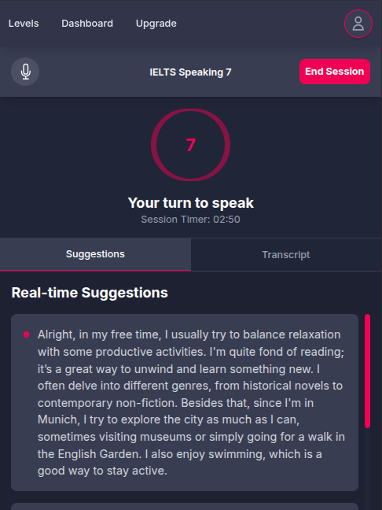

# IELTSpeak - AI-Powered IELTS Speaking Coach

**IELTSpeak** is a full-stack web application designed to empower students preparing for the IELTS Speaking test. With realistic AI-driven exam simulations, detailed performance analysis, and personalized feedback, it helps users build confidence and achieve their target band score.


_The live session interface where users engage with the AI examiner._

## ✨ Features

- **Goal-Oriented Practice**: Select your target IELTS band score for a customized test experience.
- **Realistic AI Exam Simulation**: Experience a voice-only mock test replicating all three parts of the official IELTS Speaking test, powered by an AI Examiner.
- **Dynamic AI Examiner**: Adapts question difficulty and language complexity based on your selected band score.
- **Instant, Detailed Feedback**: Receive a comprehensive score breakdown after each session, based on the four official IELTS criteria (Fluency, Lexical Resource, Grammar, Pronunciation).
- **Personalized Suggestions**: Get real-time, profile-based suggestions during sessions for natural and authentic responses.
- **Session History & Progress Tracking**: View past practice sessions and track improvement via a secure user dashboard.
- **Secure Authentication & Data Privacy**: Full user authentication and data storage with Supabase, leveraging Row Level Security for privacy.
- **Subscription-Based Access**: Monetized via Polar for seamless payments and subscriptions. Note: In previous commits, the import was done using `lemonsqueezy`.
- **App Monitoring**: Integrated with PostHog for analytics to ensure a reliable user experience.

## 🛠️ Tech Stack

Built with a modern, server-first architecture:

- **Framework**: [Next.js](https://nextjs.org/)
- **Styling**: [Tailwind CSS](https://tailwindcss.com/)
- **UI Components**: [Shadcn/UI](https://ui.shadcn.com/)
- **Database & Auth**: [Supabase](https://supabase.com/)
- **AI Conversation**: [Vapi](https://vapi.ai/)
- **AI Analysis & Suggestions**: [Google Gemini API](https://ai.google.dev/gemini-api)
- **Payments**: [Polar](https://polar.sh/)
- **Email**: [Resend](https://resend.com/)
- **Analytics**: [PostHog](https://posthog.com/)
- **Deployment**: [Vercel](https://vercel.com/)
- **Language**: [TypeScript](https://www.typescriptlang.org/)

## 📸 Screenshots

Below are key interfaces of the IELTSpeak application:

| **Levels / Exam Lobby**                         | **Results Page**                               |
| ----------------------------------------------- | ---------------------------------------------- |
|  |  |

| **User Profile**                              | **Mobile Session UI**                                 |
| --------------------------------------------- | ----------------------------------------------------- |
|  |  |

## 🚀 Getting Started

Follow these steps to set up **IELTSpeak** locally.

### Prerequisites

- Node.js (v18 or later)
- pnpm
- Accounts and API keys for:
  - Supabase
  - Google Gemini
  - Vapi
  - Resend
  - Polar
  - PostHog

### Installation

1. **Clone the repository**:

   ```sh
   git clone https://github.com/mehdi-kada/ieltspeak.git
   cd ieltspeak
   ```

2. **Install dependencies**:

   ```sh
   pnpm install
   ```

3. **Set up environment variables**:

   - Create a `.env.local` file in the project root.
   - Copy the contents of `.env.example` or add the required variables (see below).

4. **Configure Supabase**:

   - Run the SQL script in `database/schema.sql` via the Supabase SQL Editor to set up tables and policies.
   - Configure authentication and necessary database triggers.

5. **Start the development server**:

   ```sh
   pnpm dev
   ```

   Open [http://localhost:3000](http://localhost:3000) in your browser to view the app.

### Environment Variables

Add these to your `.env.local` file:

```env
# Supabase
NEXT_PUBLIC_SUPABASE_URL=your_supabase_url
NEXT_PUBLIC_SUPABASE_ANON_KEY=your_supabase_anon_key

# Google Gemini
GEMINI_API_KEY=your_gemini_api_key

# Vapi
VAPI_API_KEY=your_vapi_api_key

# Resend
RESEND_API_KEY=your_resend_api_key

# Polar
POLAR_API_KEY=your_polar_api_key
POLAR_WEBHOOK_SECRET=your_polar_webhook_secret

# PostHog
POSTHOG_API_KEY=your_posthog_api_key
NEXT_PUBLIC_POSTHOG_HOST=your_posthog_host

```

## 📄 License

This project is licensed under the MIT License. See the `LICENSE.md` file for details.
